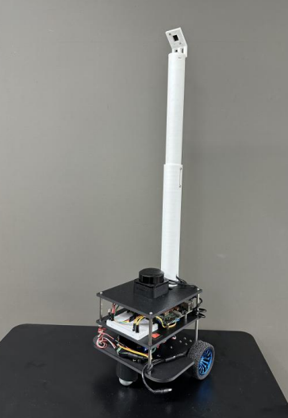

# Introduction_to_Robot_Engineering_Design

로봇공학설계입문 수업에서 진행한 자율주행 로봇 프로젝트
RaspberryPi4 + Arduino R4 Minima로 구성된 차동 구동 로봇을 사용하며,
두 보드는 UART Serial로 통신

---

## Project 1 — 거리 기반 제어

라즈베리파이에서 이동 거리(m)를 한 번 입력하면, 로봇이 그 거리만큼 정확히 직진한 뒤 정지하는 프로젝트

### 동작 방식

- **라즈베리파이** (`project1/rp-arduino_uart.py`)
  사용자가 입력한 거리 값을 `D <거리>` 형식의 명령으로 아두이노에 전송
- **아두이노** (`project1/project1.ino`)
  엔코더 카운트를 거리로 환산해 목표 카운트에 도달할 때까지 주행

### 구현 방법

- **PID 제어**
  - 위치 PID: 목표 카운트까지 남은 오차를 줄여 정확한 거리에서 정지
  - 좌우 동기화 PID: 두 바퀴의 카운트 차이를 보정해 직진성 유지
- **가감속 램프**: 출발 시 서서히 가속하고, 목표 지점 근처에서 감속해 오버슈트를 줄임
- **거리별 오차 보정**: 이동 거리에 따른 좌우 편차(`encoderdiff`)와 보정 계수를 모델링하여
  실측 오차를 줄임

---

## Project 2 — LiDAR 기반 장애물 회피

RPLiDAR C1으로 주변 장애물을 인식해, 목표지점까지 충돌 없이 자율 주행하는 프로젝트

### 동작 방식

- **라즈베리파이** (`project2/fgm_drive_final_*.py`)
  RPLidar 스캔을 받아 진행 방향을 계산하고, 선속도·각속도 명령
  (`V <v>,<w>`)을 아두이노로 전송
- **아두이노** (`project2/project2.ino`)
  받은 (v, w)를 좌우 바퀴 목표 각속도로 변환하고, 바퀴별 PID + 피드포워드로 추종

### 구현 방법

**Follow the Gap Method (FGM)** 사용

- LiDAR 스캔을 각도별 거리 배열로 변환하고 평활화
- 가장 가까운 장애물 주변을 **안전 버블**로 부풀려 막음
- 통과 가능한 연속 구간(**Gap**)을 찾고, 너무 좁은 Gap은 제거
- 정면 선호 / 목표 방향 / 직전 방향 연속성 / 개방 폭 / 누적 회전량 페널티 등을
  점수화해 최적의 목표 방향을 선택
- 목표 각도와 전방·좌우 거리에 따라 속도를 가변 제어

### 추가 로직

- **Recovery 모드**: 안전한 Gap이 없거나 막혔을 때 제자리 회전으로 새 경로를 탐색하고, 전방이 트이면 다시 FGM 주행으로 복귀
- **좌우 벽 보정**: 좁은 통로에서 조향각·속도 상한을 낮춰 벽 충돌 방지

---

## Project 3 — 색상 영역 순차 탐색

카메라와 LiDAR를 함께 사용해 RED → YELLOW → BLUE 순서로 색상 영역을 찾아 진입하는 자율 탐색 프로젝트

### 파일 구성

| 파일 | 역할 |
|------|------|
| `project3/camera.py` | Picamera2 카메라 제어 및 HSV 색상 인식 |
| `project3/lidar.py` | RPLiDAR C1 드라이버 및 Gap 기반 장애물 회피 |
| `project3/main.py` | 전체 주행 상태 머신 및 엔코더 오도메트리 |

### 동작 방식

- **라즈베리파이** (`project3/main.py`)
  카메라와 LiDAR 데이터를 매 루프(50ms)마다 처리하고, 상태 머신에 따라 선속도·각속도 명령(`V <v>,<w>`)을 아두이노로 전송
- **아두이노** (별도 `.ino`)
  수신한 (v, w)를 좌우 바퀴 목표 각속도로 변환해 엔코더 피드백으로 추종하고, 오도메트리(`O,<L>,<R>,<ms>`)를 라즈베리파이에 전송

### 구현 방법

#### camera.py — HSV 색상 인식

- Picamera2로 640×400 RGB 프레임을 캡처하고 90° 회전 보정
- Gaussian Blur → HSV 변환 → 색상별 임계값(`HSV_RANGES`) 마스크 적용 → Morphological Open으로 노이즈 제거
- 컨투어 면적 기준으로 가장 큰 영역을 추적 대상(`pick`)으로 선택
- 중심(cx, cy) 기반 오차를 계산해 `follow_cmd`(비례 조향)로 색상 추종 속도·각속도 생성
- 색상 영역이 프레임 하단(`BOTTOM_LOST_RATIO=0.90`) 혹은 전방 중심(`COLOR_FORWARD_CENTER_RATIO=0.95`)에 도달했는지 판별

#### lidar.py — Gap 기반 장애물 회피

- RPLiDAR C1과 UART(460800 baud)로 통신하며 5바이트 패킷을 파싱해 각도·거리 스캔을 백그라운드 스레드로 수집
- ±100° FOV를 1° 간격 배열로 매핑 후 `FREE_D(0.28m)` 이상인 연속 구간을 Gap으로 추출
- Gap 양쪽 끝의 현 길이(`gap_clearance`)가 로봇 폭(`ROBOT_PASS_WIDTH=0.24m`) 이상인 Gap만 통과 가능으로 판단
- 색상 추종 중 장애물: 색상 방향에 가장 가까운 Gap 선택 + 반대쪽 벽 반발 보정(`OPPOSITE_WALL_GAIN=1.5`)으로 색상 영역 쪽 경로 확보
- 탐색 중 장애물: 가장 넓고 정면에 가까운 Gap 선택 + 좌우 대칭 벽 반발 보정

#### main.py — 상태 머신 및 탐색 전략

**색상 추적 상태**

| 상태 | 조건 | 동작 |
|------|------|------|
| `FOLLOW` | 색상 인식, 장애물 없음 | 색상 중심 추종 |
| `AVOID: color + obstacle` | 색상 인식, 장애물 있음 | Gap 회피 후 색상 방향 재진입 |
| `ALIGN` | 색상 하단 도달 + 중심 오차 큼 | 제자리 정렬 후 진입 |
| `SWITCH` | 색상 전방 도달 | 다음 색상으로 전환, 2cm 전진 후 대기 |

**색상 소실 및 탐색 상태**

| 상태 | 조건 | 동작 |
|------|------|------|
| `SEARCH: last color direction` | 색상 소실 | 마지막으로 색상이 있던 방향으로 360° 제자리 회전 탐색 |
| `SEARCH: next color` | 색상 전환 직후 소실 | 180° 제자리 회전으로 새 방향 탐색 |
| `EXPLORE: spiral` | 360° 탐색 후에도 미발견 | 아르키메데스 나선 탐색 |

**아르키메데스 나선 탐색 (`SpiralExplorer`)**

- 엔코더 오도메트리로 로봇 위치(x, y, θ)를 실시간 적산
- 나선 경로 `r = SPIRAL_GROWTH × θ` 위의 전방주시 목표점을 향해 비례 조향
- 최대 반경(`SPIRAL_MAX_RADIUS=1.5m`) 도달 시 반대 방향으로 수렴 나선 전환
- 장애물로 막히면 앵커(복귀 목표점)를 저장하고 Gap 회피로 우회; 앵커 도달 후 나선 재개
- 회피·복귀 중에도 나선 반경을 정상 속도의 1/2(`SPIRAL_AVOID_ADVANCE=0.025 rad/루프`)로 계속 증가시켜 같은 지점에 갇히는 것을 방지